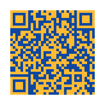

# racket-simple-qr

A Qr Code Writer Library For Racket
==================

# Install
    raco pkg install simple-qr

# Usage

```racket
(define (qr-write data file_name
                  #:mode [mode 'B]
                  #:error_level [error_level 'H]
                  #:module_width [module_width 5]
                  #:color [color '("black" . "white")]
                  #:output_type [output_type 'png]
                  ))
```

output qr code image to file.
  
color's form is '(front_color . background_color).
  
use color 'transparent to set transparent background.

# Example

```racket
#lang racket

(require "../main.rkt")

(qr-write "https://github.com/simmone" "normal.png")

(qr-write "https://github.com/simmone" "normal_color.png" #:color '("#ffbb33" . "#0d47a1"))

(qr-write "https://github.com/simmone" "normal_trans.png" #:color '("#9933CC" . transparent))

(qr-write "https://github.com/simmone" "small.png" #:module_width 2)

(qr-write "https://github.com/simmone" "large.png" #:module_width 10)

(qr-write "https://github.com/simmone" "normal.svg" #:output_type 'svg)

(qr-write "https://github.com/simmone" "large.svg" #:module_width 10 #:output_type 'svg)

(qr-write "https://github.com/simmone" "normal_color.svg" #:color '("#ffbb33" . "#0d47a1") #:output_type 'svg)

(qr-write "https://github.com/simmone" "normal_trans.svg" #:color '("#9933CC" . transparent) #:output_type 'svg)
```

# Png

normal.png:


normal_color.png:

)

normal_trans.png:


small.png:


large.png:


# SVG

normal.svg:


large.svg:


normal_color.svg:


normal_trans.svg:


